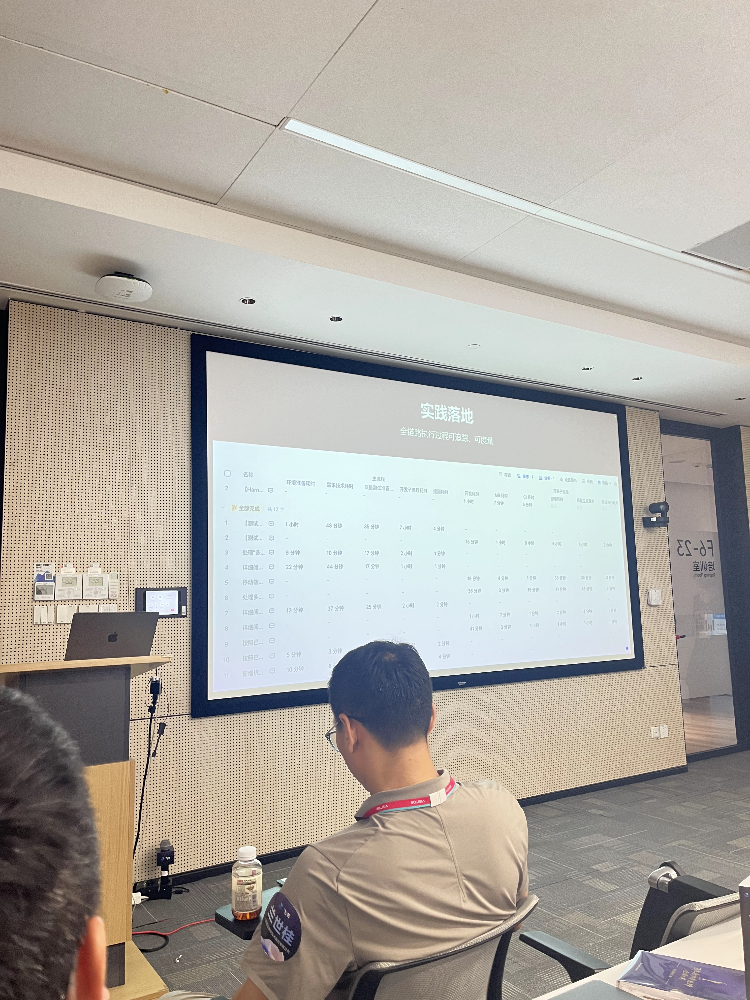
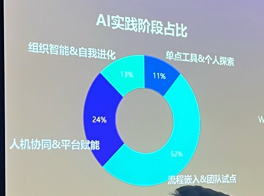

# AI Native 时代为什么企业要建 Agent + 人 协作的软件交付流水线

> 来源：[飞书文档](https://nio.feishu.cn/wiki/MZb1wrE4Ui8DDLkOhMNcRVtnnxe)
> 转换时间：2026-06-05

> **摘要**：AI Coding 在开发者侧快速普及，"10X 程序员"成为行业热词。但在企业真实场景中，个体效率暴增与组织效率提升之间存在明显落差。本文结合行业研究数据与头部企业实践，论证：AI Native 时代，企业需要的不是"砍掉流水线"，而是让 Agent 进入流水线，实现 Agent 与人协同的新型研发模式。

---

## 一、核心矛盾：个体繁荣 vs 组织落差

### 1.1 个体层面的繁荣

AI Coding 工具让开发者"感觉很快"，这个感受有大量数据支撑：

| 研究来源 | 规模 | 关键数据 |
|-|-|-|
| NBER（MIT + UPenn，2026年5月） | 10万+ GitHub 开发者 | Autocomplete 提交代码 +40%；Sync Agent（Claude Code 类）+140%；Async Agent（自主编码 Agent）**+180%** |
| Faros AI（2026年4月） | 1,255支团队、超万名开发者 | 高频 AI 使用团队合并 PR 数量 **+98%**，完成任务量 **+21%** |
| Microsoft / GitHub | 大规模开发者样本 | 任务完成速度提升 **55.8%**，成功率提升 **78%** |
| METR RCT（资深开发者实测） | 16位开发者 | 开发者预期 AI 提速 **24%** |
| DX 平台（13.5万+开发者） | 大规模调查 | 高频使用者每日合并 PR 量比低频用户高出 **60%** |

这些数字催生了"10X 程序员"甚至"20X 程序员"的概念。但这些数字都是**个体视角**的——真正的问题发生在团队和组织层面。

### 1.2 组织层面的落差

当视角从个体切换到团队/组织层面，情况截然不同：

**NBER 最权威衰减证据：180% → 30% 的衰减路径**

NBER 2026年5月发布的实证研究（Working Paper 35275）追踪了从 Autocomplete 到 Sync Agent 再到 Async Agent 三代工具，在软件生产六层产出指标上的衰减路径：

| 产出指标 | Autocomplete（基础补全） | Sync Agent（Claude Code 类） | Async Agent（自主编码 Agent） |
|-|-|-|-|
| 代码行数 | +228% | +741% | **+1730%** |
| 涉及文件数 | +50% | +250% | **+390%** |
| 提交次数（Commit） | +36% | +140% | **+180%** |
| 拉取请求数（PR） | +12% | +65% | **+150%** |
| 项目数量 | +13% | +40% | **+50%** |
| 版本发布数（Release） | **+10%** | **+30%** | **+30%** |

> **核心结论**：AI 生成能力越强，衰减越剧烈。Async Agent 在代码提交层面实现了惊人的 +180%，但最终版本发布仅 +30%。生产链条的每一层级都存在人类瓶颈，将上游的增益逐级吞噬。

**Faros AI 的团队级发现：98% 更多 PR，零 DORA 改善**

Faros AI 对 1,255 支团队、超万名开发者的研究揭示了衰减的内部机制：

| 指标 | 数据 | 含义 |
|-|-|-|
| PR 合并量 | **+98%** | 个体/团队级产出大幅提升 |
| PR 审查时间 | **+91%** | 人类节点成为瓶颈 |
| 平均 PR 规模 | **+154%** | AI 生成更大的代码块，审查难度上升 |
| DORA 指标（部署频率、Lead Time、变更失败率） | **基本持平** | 公司级综合效能提升有限 |
| 人均 Bug 数量 | **+9%** | AI 辅助 PR 问题率更高 |
| 团队级综合效能提升 | **约 15%** | 与个体的 +98% 形成巨大落差 |

**METR 的反转：预期 +24%，实际 -19%**

METR 随机对照实验在真实代码库中测量 AI 对资深开发者的影响：

- 开发者实验前预期提速 **+24%**
- 实验后实测：整体工作流**反而慢了 19%**
- 更值得关注的是：实验后开发者**仍认为 AI 帮了他们提速 20%**——"感觉更快"与"实际更快"之间存在巨大的认知偏差

### 1.3 为什么会这样：三个结构性原因

**原因一：AI 解决了"生产速度"，没有解决"生产秩序"**

AI Coding 加速了代码生成，但软件生产是一条包含需求、设计、编码、审查、测试、部署、运维的多层级流水线。AI 在"写代码"这一层的效率暴增，但整条流水线的吞吐取决于最慢的那个节点——而这个节点通常是人类负责的审查和决策环节。

**原因二：加速冲击波——瓶颈后移，而非消失**

开发速度被 AI 大幅拉升后，测试、评审、部署能力未能同步升级，交付瓶颈后移至整个链条中最慢的环节。Faros 数据显示，PR 审查时间 +91%，而代码生成速度的提升并没有同等传导到审查速度上。

**原因三：个体增益被组织摩擦吸收**

软件开发天然是跨团队协作（业务—产品—设计—研发—运维）。某一环节的效率提升如果无法传导到下游，增益就被内部消耗掉了。NBER 的衰减数据（代码 +1730% → 发布 +30%）直观地展示了每一级摩擦的叠加效应。

> ❤️ **结论**：没有流水线约束的情况下，个体越强，组织的无序程度可能越高。AI 是个体效率的放大器，但不是组织效率的自动提升器。

---

## 二、流水线为何不可或缺：三个根本价值

### 2.1 价值一：定义"��产秩序"

没有流水线，AI Coding 会导致：

- 研发流程割裂：需求、开发、测试分散在多个系统，跨系统协同成本高
- 测试承压加剧：开发速度被拉升，测试能力未同步升级，缺陷外溢到生产环境
- 质量方差扩大：有流程约束的团队与无约束团队之间，交付质量差距可达数倍

> ⚠️ 流水线定义了信息如何流转、谁在哪个节点负责什么、什么条件下可以进入下一阶段——这是 AI 无法自动建立的"生产秩序"。

### 2.2 价值二：规模化复用

没有流水线：

- 不同团队、不同个人，AI 工具使用方式各异，难以形成组织级能力积累
- Prompt 工程、代码模板、最佳实践散落在个人层面，无法跨团队复用
- 工具碎片化：Cursor / Copilot / Claude Code 各行其是，没有统一治理

> ⚠️ 流水线将 Agent 的能力封装为组织级资产，实现**能力复用**而非**工具散用**。

### 2.3 价值三：可度量、可改进

没有流水线，软件交付流程就是黑盒：

- 哪个环节成本（Token、耗时）最高？不知道
- AI 引入后哪个环节真正提速了？不知道
- 瓶颈到底在哪？是需求设计、开发测试、评审、还是部署？不知道
- 整个产品线所有需求当前状态是什么？不知道

> ⚠️ 流水线提供数据基础设施，让参与者能够看到软件交付的全貌，识别浪费和卡点，定向爆破。

---

## 三、行业实践：头部企业怎么做的

5月26日飞书举办的《AI 组织研发管理研修班》（上海站）的活动上，有86家企业的调查显示，在76%的企业处于流程嵌入、人机协同和平台赋能阶段。

### 3.1 谷歌（Google）

2026年4月，谷歌 CEO 宣布内部 **75% 的新增代码**由 AI 生成（半年前为 50%）。但这一数字背后，是谷歌多年建设的**标准化 CI/CD 流水线 + 严格的 AI 代码审查机制**作为保障。没有这套基础设施，75% 的 AI 代码 = 75% 的潜在风险。

### 3.2 Apollo.io（250+ 工程师团队）

- **AI 一线培训**：所有工程师必须先掌握 AI 工具使用方法，再参与实际项目
- **双轨审查机制**：AI BugBot + CodeRabbit 自动检测逻辑和运行时 Bug，人工 Code Review 作为第二道防线
- **自定义规则**：基于 RuboCop 开发了专门捕获 AI 常见问题的规则，覆盖 **92%** 的 Pull Request
- **结果**：在团队规模持续扩张的情况下，代码质量不降反升，PR 吞吐量提升 **3~4 倍**

关键点：Apollo.io 没有"砍掉流水线"，而是**把 Agent 嵌入流水线**，让它承担流水线中的重复性审查工作，人聚焦在需要判断力的高价值审查。

### 3.3 腾讯（内部研发）

- 90% 的工程师使用 AI 编程助手
- 50% 新增代码由 AI 辅助生成
- **同时**：建立了覆盖"需求→开发→AI 辅助审查→人工复核→自动化测试→部署"的完整研效体系

这不是"有了 AI 就不需要流程"，而是"AI 在流程中找到了最合适的位置"。

### 3.4 埃森哲（Accenture）

- GitHub Copilot 部署：平均 PR 周期从 **9.6 天压缩至 2.4 天**（-75%）
- PR 合并率提升 **15%**，构建成功率提升 **84%**
- **关键**：埃森哲同步投入了"审查者赋能"——将 AI 生成的代码拆解为更小、更易审查的单元，保持小批量交付纪律

> 没有配套的流程变革，Copilot 只会让 PR 队列更长，而不是让交付更快。

---

## 四、Agent 进入流水线带来的三重价值

当 Agent 被正式引入研发流水线后，企业可以获得：

### 4.1 组织效率提升

- Agent 承担流水线中的重复性工作（代码格式化、基础 Bug 检测、测试用例生成、文档初稿），人聚焦架构设计和复杂决策
- 流水线吞吐不再受限于人类工作节拍，而是按机器节拍运行
- 减少执行与流程状态变更的脱节，执行即交付、交付即度量，数据准确可衡量

### 4.2 质量稳定提升

- AI 代码审查覆盖率远超人工：92% 的 PR 覆盖自动审查
- 测试能力前移，各环节通过自动AI质量门禁，重点环节的人工审批确保质量始终可控
- 减少高频返工：Apollo.io 数据显示，AI 审查使人均返工次数显著下降

### 4.3 交付确定性增强

- 过程可管理：流水线提供实时可见的每个环节状态
- 结果可审计：每一次代码变更都有完整记录
- 投入产出可量化：DORA 指标变得透明，管理层可以看到 AI 引入后的真实效能变化

---

## 五、核心结论

| 观点 | 事实 |
|-|-|
| "Agent 足够强，流水线是工业时代遗留" | NBER：AI 生成代码 +180%，但版本发布仅 +30%；Faros：团队综合效能仅提升约 **15%** |
| "个体效率 = 组织效率" | Faros：个体 PR 吞吐量 +98%，但 DORA 指标未见显著改善；METR：开发者预期 +24%，实际 -19% |
| "砍掉流程才能真正提效" | 谷歌 75% 代码 AI 生成，背后是多年 CI/CD + 审查体系；埃森哲缩短 PR 周期 75%，同步投入了审查者赋能 |

> 🐵 **AI Native 时代，正确的解法不是"砍掉流水线"，而是：**
> **让 Agent 进入流水线，成为流水线中有明确角色和边界的高能力节点；让人回到需要判断力、创造力、决策力的环节。**

---

## 下一篇

[多 Agent组团与多 Agent流水线软件交付模式对比](https://nio.feishu.cn/wiki/P0Oewx6FpiU2NOkTUrJc7J3MnSb)

## 参考来源

1. **NBER Working Paper 35275**（2026年5月）：Mert Demirer, Leon Musolff, Liyuan Yang，"Writing Code vs. Shipping Code: Productivity Effects Across Generations of AI Coding Tools"，MIT + UPenn + NBER，10万+ GitHub 开发者实证研究
2. **Faros AI**，"AI Coding at Scale: What 1,255 Teams Reveal About Enterprise AI Adoption"，2026年4月
3. **AgentMarketCap**：Faros AI 研究解读——"98% More PRs, Zero DORA Improvement"，2026年4月
4. **AgentMarketCap**：Faros AI 研究解读——"The Coding Agent Productivity Paradox"，2026年4月
5. [词元无限 x 飞书项目：让 Agent 走进研发流程，走向确定性交付](https://www.tokensinfinity.com/blog/feishu?backPath=/#section-3-0)
6. https://bytedance.aiforce.cloud/app/app_4k7zu46ucr6e5
